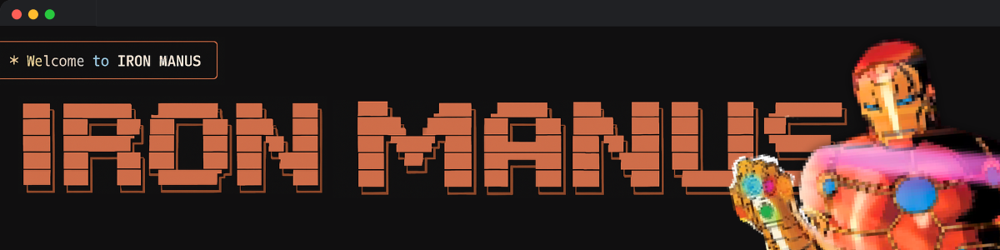

[](https://github.com/dnnyngyen/iron-manus-mcp/actions)
[](https://github.com/dnnyngyen/iron-manus-mcp/actions)
[](https://www.typescriptlang.org/)
[](https://nodejs.org/)
[](https://opensource.org/licenses/MIT)
[](https://hub.docker.com/r/dnnyngyen/iron-manus-mcp)
[](https://github.com/dnnyngyen/iron-manus-mcp/pkgs/container/iron-manus-mcp)
[](https://github.com/dnnyngyen/iron-manus-mcp)

# Iron Manus MCP (J.A.R.V.I.S.)

**Claude-code MCP server that spawns agents as tools** - An agent orchestration system that lets Claude autonomously break down complex workflows by structured phases and delegate to subagents with native context management.

## Fit over 300k+ tokens in one session

<div align="center">

### 📹 GIF Demo


#### 🎥 Video Tutorials

| **Quick Demo** | **Demo + Explanations** |
|:---:|:---:|
| [](https://www.youtube.com/watch?v=CWuQ_PvZkOs) | [](https://www.youtube.com/watch?v=EFVQT3pmyTc) |
| **[Watch the quick demo](https://www.youtube.com/watch?v=CWuQ_PvZkOs)** | **[Watch the detailed walkthrough](https://www.youtube.com/watch?v=EFVQT3pmyTc)** |

</div>

## What It Does

Iron Manus MCP is a comprehensive FSM-driven orchestration system that manages complex workflows through structured phases. It features a complete tool registry with JARVIS FSM controller and intelligent API selection from 65+ endpoints.

**8-Phase Workflow**: `INIT → QUERY → ENHANCE → KNOWLEDGE → PLAN → EXECUTE → VERIFY → DONE`

**Key Features:**

- 🔄 **8-Phase Orchestration Loop** - Structured workflow orchestration with complete FSM states
- 🧠 **Optimized Context Management** - Subagent delegation enables 300k+ token conversations  
- 🛠️ **Modular Tool Registry** - 8+ specialized tools with extensible architecture
- 📡 **65+ API Registry** - Intelligent API discovery and selection system
- 🔒 **SSRF Protection** - Enterprise-grade security with allowlist validation
- ✅ **163/163 Tests Passing** - Comprehensive test coverage with Vitest (100% success rate)
- 📦 **ES Modules** - Modern JavaScript with TypeScript 5.0 support

## Quick Start

> **📦 Docker Images**: v0.2.3 (stable, published)  
> **📄 Source Code**: v0.2.4 (latest, with comprehensive JSDoc documentation)

### Option 1: Docker (Recommended - v0.2.3)

**Docker Hub:**
```bash
# Pull and run from Docker Hub (v0.2.3 - stable)
docker pull dnnyngyen/iron-manus-mcp:0.2.3
docker run -d --name iron-manus-mcp dnnyngyen/iron-manus-mcp:0.2.3

# Alternative: Use latest tag
docker pull dnnyngyen/iron-manus-mcp:latest
docker run -d --name iron-manus-mcp dnnyngyen/iron-manus-mcp:latest

# Or using docker-compose
curl -O https://raw.githubusercontent.com/dnnyngyen/iron-manus-mcp/main/docker-compose.yml
docker-compose up -d
```

**GitHub Container Registry:**
```bash
# Pull and run from GitHub Container Registry (v0.2.3 - stable)
docker pull ghcr.io/dnnyngyen/iron-manus-mcp:0.2.3
docker run -d --name iron-manus-mcp ghcr.io/dnnyngyen/iron-manus-mcp:0.2.3

# Alternative: Use latest tag
docker pull ghcr.io/dnnyngyen/iron-manus-mcp:latest
docker run -d --name iron-manus-mcp ghcr.io/dnnyngyen/iron-manus-mcp:latest
```

### Option 2: From Source (v0.2.4 - Latest with JSDoc)

```bash
# Clone and install (v0.2.4 - includes comprehensive JSDoc documentation)
git clone https://github.com/dnnyngyen/iron-manus-mcp
cd iron-manus-mcp
npm install

# Build TypeScript
npm run build

# Run tests (optional - 313 tests)
npm test

# Start server
npm start
```

**If npm install hangs or fails:**
```bash
# Clean and retry
rm -rf node_modules package-lock.json
npm cache clean --force
npm install --no-optional

# If it still fails, install core dependencies first:
npm install @modelcontextprotocol/sdk@^1.13.2 typescript@^5.0.0
npm run build
```

## ⚠️ Legacy File Prevention

This project uses knowledge graph state management. If you see files like `iron_manus_*.json`, immediately:
1. Stop the server: `pkill -f iron-manus`
2. Remove files: `rm -f iron_manus_*.json` 
3. Clean rebuild: `rm -rf dist/ && npm run build`

See [LEGACY_PREVENTION.md](./LEGACY_PREVENTION.md) for details.

**For MCP Integration:**
Add to your MCP client configuration or register with Claude Code:
```bash
claude mcp add iron-manus-mcp node dist/index.js
```

## Docker Usage

### Docker Compose (Recommended)

The easiest way to run Iron Manus MCP is using Docker Compose:

```yaml
# docker-compose.yml
services:
  iron-manus-mcp:
    image: dnnyngyen/iron-manus-mcp:0.2.3  # or :latest
    container_name: iron-manus-mcp
    restart: unless-stopped
    stdin_open: true
    tty: true
    environment:
      - KNOWLEDGE_MAX_CONCURRENCY=2
      - KNOWLEDGE_TIMEOUT_MS=4000
      - ALLOWED_HOSTS=api.github.com,httpbin.org,api.openai.com
      - ENABLE_SSRF_PROTECTION=true
```

```bash
# Start the service
docker-compose up -d

# View logs
docker-compose logs -f iron-manus-mcp

# Stop the service
docker-compose down
```

### Docker Commands

```bash
# Pull latest stable version (v0.2.3)
docker pull dnnyngyen/iron-manus-mcp:0.2.3

# Run with custom environment variables
docker run -d \
  --name iron-manus-mcp \
  -e KNOWLEDGE_MAX_CONCURRENCY=3 \
  -e ALLOWED_HOSTS="api.github.com,httpbin.org" \
  dnnyngyen/iron-manus-mcp:0.2.3

# View container logs
docker logs iron-manus-mcp

# Stop and remove container
docker stop iron-manus-mcp && docker rm iron-manus-mcp
```

### Available Tags

**Docker Registry Tags:**
- `0.2.3` - Current stable published version (recommended for production)
- `latest` - Points to v0.2.3 stable release
- `stable` - Alias for v0.2.3

**Available Registries:**
- Docker Hub: `dnnyngyen/iron-manus-mcp:0.2.3`
- GitHub Container Registry: `ghcr.io/dnnyngyen/iron-manus-mcp:0.2.3`

> **Note**: Source code v0.2.4 includes comprehensive JSDoc documentation improvements.
> Docker images will be updated to v0.2.4 in the next release.

## Example Usage

**Input:**
```typescript
await mcp.callTool({
  name: 'JARVIS',
  args: {
    session_id: 'demo',
    initial_objective: 'Build a TypeScript API with tests'
  }
});
```

**6-Phase Flow:**
1. **QUERY** - Analyze request and detect role
2. **ENHANCE** - Add missing requirements and context
3. **KNOWLEDGE** - Auto-discover relevant APIs and patterns
4. **PLAN** - Create structured tasks with meta-prompts
5. **EXECUTE** - Process tasks with specialized tools
6. **VERIFY** - Validate completion and quality

## Available Tools

- `JARVIS` - Main FSM controller (8-phase orchestration)
- `APISearch` - Intelligent API discovery from 65+ endpoint registry
- `MultiAPIFetch` - Parallel HTTP requests with SSRF protection
- `IronManusStateGraph` - Project-scoped FSM state management
- `APIValidator` - Response validation and confidence scoring

## Development

**Prerequisites:**
- Node.js 18+ (tested with 18.x, 20.x, 22.x)
- npm 8+
- TypeScript 5.0+

**Available Scripts:**
```bash
npm run build        # TypeScript compilation
npm test            # Run full test suite (163 tests)
npm run test:nocov   # Run tests without coverage
npm run lint        # ESLint checking
npm run format      # Prettier formatting
npm start          # Start compiled server
npm run dev        # Build and start server
```

**Configuration:**
Environment variables for customization:
```bash
KNOWLEDGE_MAX_CONCURRENCY=2          # API concurrency limit
KNOWLEDGE_TIMEOUT_MS=4000            # Request timeout
ALLOWED_HOSTS="api.github.com,httpbin.org"  # SSRF whitelist
ENABLE_SSRF_PROTECTION=true          # Security toggle
MIN_COMPLETION_PERCENT=70            # Quality threshold
```

## Testing

Comprehensive test suite with 163 tests using Vitest:

```bash
# Run all tests
npm test

# Run tests without coverage
npm run test:nocov

# Run specific test types
npm run test:unit
npm run test:integration
npm run test:e2e
```

**Test Coverage:**
- Configuration management
- SSRF protection and security
- FSM state transitions
- Tool integrations
- API registry functionality
- Server initialization and MCP compliance

## Security

### Enhanced Security with Claude Code Hooks Integration

Iron Manus MCP now features comprehensive security validation through [Claude Code Hooks](https://docs.anthropic.com/en/docs/claude-code/hooks) integration, providing deterministic security enforcement alongside the cognitive FSM layer.

**Built-in Security Features:**
- Blocks private/localhost IPs (192.168.x.x, 127.x.x.x, etc.)
- Validates URL schemes (HTTP/HTTPS only)
- Enforces allowlist when configured
- Request timeout and size limits
- Rate limiting per API endpoint

**Claude Code Hooks Security Enhancements:**
- **Command Validation**: PreToolUse hooks block dangerous bash commands (`rm -rf`, etc.)
- **Enhanced SSRF Protection**: Additional URL validation with allowlist enforcement
- **Code Quality Gates**: Output validation prevents security issues in generated code
- **Session Monitoring**: Comprehensive tracking of FSM progression and security events

See `.claude/HOOKS_INTEGRATION.md` for complete hook configuration and security implementation details.

## Architecture

**Core Components:**
- **FSM Engine** - 8-phase state machine orchestration
- **Tool Registry** - Modular tool architecture with dependency injection
- **API Registry** - 65+ APIs with role-based selection
- **Security Layer** - SSRF guard with comprehensive validation
- **Type System** - Full TypeScript interfaces and schemas

## License

MIT - See [LICENSE](LICENSE) file for details.

## Version History

- **v0.2.4** - (Source) Comprehensive JSDoc documentation, professional standards
- **v0.2.3** - (Docker) Published Docker images with clean configuration 
- **v0.2.2** - Stable release with comprehensive test coverage and build improvements
- **v0.2.1** - Claude Code Hooks integration with enhanced security validation
- **v0.2.0** - Complete refactor with Jest→Vitest migration, repository flattening, 8-phase FSM
- **v0.1.x** - Initial release with 6-phase workflow

> **Current Status**: Docker images (v0.2.3) provide stable functionality, while source code (v0.2.4) includes the latest documentation improvements.

---

**Built for modern AI orchestration** - Structured workflows meet intelligent automation.
