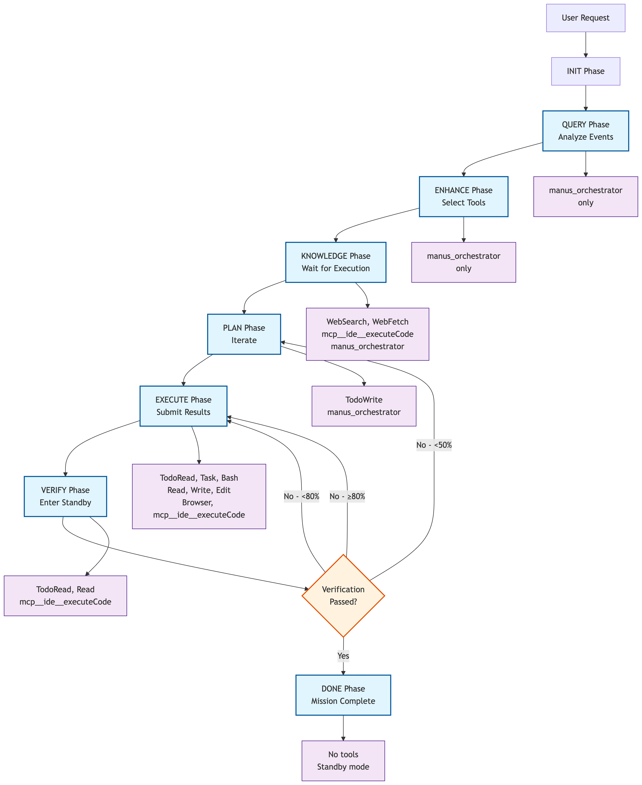

# 🦾Iron Manus MCP (J.A.R.V.I.S.)

[](https://github.com/dnnyngyen/iron-manus-mcp/releases)
[]()
[]()
[](https://opensource.org/licenses/MIT)
[]()

**Model Context Protocol Server with Meta Thread-of-Thought Orchestration**

A modular MCP server implementing Meta Thread-of-Thought architecture that applies Thread-of-Thought context segmentation patterns to FSM orchestration, enabling Claude to orchestrate its own cognitive workflows through structured phases and hierarchical task delegation.

## Overview

Unlike traditional Chain-of-Thought (single-task reasoning) or Tree-of-Thought (multi-path exploration), Iron Manus implements **Meta Thread-of-Thought Orchestration** - where Claude uses Thread-of-Thought patterns for FSM-driven workflow management rather than reasoning tasks.

### Approach

**Architectural Pattern:** Following the Meta Chain-of-Thought model ([arXiv:2501.04682](https://arxiv.org/abs/2501.04682)) which builds meta-reasoning upon Chain-of-Thought ([arXiv:2201.11903](https://arxiv.org/abs/2201.11903)), Iron Manus creates **Meta Thread-of-Thought Orchestration** by building meta-orchestration upon Thread-of-Thought ([arXiv:2311.08734](https://arxiv.org/abs/2311.08734)).

**Implementation:**
- **Base Form:** Thread-of-Thought context segmentation patterns (THoT)
- **Meta Extension:** FSM orchestration using THoT patterns for workflow management
- **Hybrid Integration:** Claude Code's native Chain-of-Thought for structured reasoning within each phase
- **Self-Orchestration:** Native meta-cognitive tools (TodoWrite/TodoRead/Task) enable runtime recursion

**Key Distinction:** Traditional THoT segments contexts for reasoning; Meta THoT segments contexts for **orchestration** - using context isolation patterns to manage cognitive workflows rather than solve reasoning problems.

**Key Innovation:** Self-contained orchestration where spawned agents operate within the same Claude instance using TodoWrite/TodoRead/Task() tools, requiring no external infrastructure.

**Context Segmentation Solution:** Addresses Claude Code's biggest weakness (context limitations) through:
- **FSM phase segmentation:** Each phase operates with focused context scope *(Software 3.0: natural language becomes structured workflow)*
- **Task() agent isolation:** Spawned agents get their own dedicated context windows *(Software 3.0: cognitive processes become executable units)*
- **Progressive context management:** Information flows between phases without overwhelming any single context *(Software 3.0: AI manages its own cognitive architecture)*

*For detailed paradigm comparison, see [COGNITIVE_PARADIGMS.md](./docs/COGNITIVE_PARADIGMS.md)*

**What makes this unique:** This MCP server provides tools that enable Claude to orchestrate its own meta-cognitive processes, creating a self-managing cognitive architecture that adapts reasoning strategies based on task complexity and domain requirements.

**Technical Implementation:** Built as a production-ready MCP server with 6-phase FSM orchestration, 65+ API registry, role-based cognitive enhancement, and fractal task decomposition capabilities.

## Claude Code Native Feature Integration

Thread-of-Thought Meta-Orchestration works because Iron Manus leverages Claude's existing meta-cognitive capabilities while providing structured cognitive scaffolding:

### 1. TodoWrite/TodoRead Tools

**What it does:** Claude's native task management system  
**How Iron Manus uses it:**
- **Phase PLAN:** Creates structured task breakdowns with meta-prompts
- **Phase EXECUTE:** Reads current tasks and manages execution flow  
- **Fractal orchestration:** Sub-agents create their own todo hierarchies

### 2. Task() Tool

**What it does:** Claude's native agent spawning capability  
**How Iron Manus uses it:**
- **Meta-prompt conversion:** `(ROLE: coder) (CONTEXT: auth) (PROMPT: implement JWT) (OUTPUT: code)` → Task() agent
- **Recursive delegation:** Spawned agents can spawn their own sub-agents
- **Role specialization:** Each Task() inherits specific thinking methodologies

### 3. Single-Tool-Per-Iteration Enforcement

**What it does:** Claude Code's tool constraint system  
**How Iron Manus uses it:**
- **Phase-based whitelists:** Each phase allows specific tools only
- **Natural guidance:** Tool constraints presented as helpful suggestions
- **Systematic flow:** Forces structured progression through cognitive phases

### 4. MCP Integration Layer

**What it does:** Claude Code's tool integration protocol  
**How Iron Manus uses it:**
- **External cognitive scaffolding:** FSM provides thinking structure from outside Claude
- **State persistence:** Session management across tool calls
- **Meta-cognitive prompting:** Role-specific thinking methodologies injected per phase

**Thread-of-Thought Meta-Orchestration works because:**

1. **Claude already has meta-cognitive capabilities** (TodoWrite, Task())
2. **Iron Manus provides cognitive structure** (6-phase FSM guidance)  
3. **MCP enables external orchestration** (FSM guides Claude's native thinking)
4. **Tool restrictions create systematic flow** (allowed_next_tools per phase)
5. **Role-based prompting enhances cognition** (specialized thinking methodologies)

**Why This Is Unique:**

Traditional approaches try to build orchestration OUTSIDE the LLM.

Iron Manus uses Claude's existing meta-cognitive tools but provides structured cognitive scaffolding through MCP that guides HOW Claude thinks about complex projects.

**Result:** Claude orchestrates its own reasoning processes using its native capabilities, but with Thread-of-Thought structure that ensures systematic, role-appropriate, hierarchical task management.

## Attribution & Disclaimers

**Not affiliated with Manus AI.** "Iron Manus" inspired by Andrej Karpathy's "Iron Man" analogy for software development automation.

**Built upon:**
- **Core MCP Architecture**: Forked from [MCP Sequential Thinking Server](https://github.com/modelcontextprotocol/servers/tree/main/src/sequentialthinking)
- **API Registry**: Curated from [Public APIs](https://github.com/public-apis/public-apis) project

The system operates without external API keys, utilizing Claude's native tool capabilities for task management and execution.

## Architecture

### Core Components

- **JARVIS FSM Controller** - Implements 6-phase state machine: QUERY → ENHANCE → KNOWLEDGE → PLAN → EXECUTE → VERIFY
- **MultiAPIFetch** - Parallel HTTP requests with timeout management and JSON truncation
- **APISearch** - Intelligent API discovery with role-based filtering from 65+ endpoint registry
- **KnowledgeSynthesize** - Cross-validation engine with conflict resolution and confidence scoring

### Key Features

- **Modular Tool System** - Each tool operates independently with consistent interfaces
- **Role-Based Processing** - 9 specialized roles (planner, coder, critic, researcher, analyzer, synthesizer, ui_architect, ui_implementer, ui_refiner)
- **Fractal Orchestration** - Task decomposition through meta-prompt generation and Task() agent spawning
- **Auto-Connection** - Automated API discovery, fetching, and knowledge synthesis

## 🚀 Quick Start Guide

### Prerequisites
- Node.js 18+ installed
- Claude Code CLI tool
- Git (for cloning)

```
╔══════════════════════════════════════╗
║           3 SETUP METHODS            ║
║  Choose the one that fits your env   ║
╚══════════════════════════════════════╝
```

---

### 1️⃣ Method 1: Standard Setup ✅ (Recommended)

**Step 1: Clone and Build**
```bash
git clone https://github.com/dnnyngyen/iron-manus-mcp
cd iron-manus-mcp
npm install
npm run build
```

**Step 2: Register MCP Server**
```bash
claude mcp add iron-manus-mcp node dist/index.js
```

**Step 3: Verify Setup**
```bash
/mcp
```
✓ Expected output: Shows "iron-manus-mcp" server listed

**Step 4: Test Functionality**
In Claude Code, run:
```
Test the JARVIS FSM controller functionality
```
✓ Expected: JARVIS responds with phase progression

---

### 2️⃣ Method 2: Alternative Setup ⚠️ (If Bash Issues)

**Step 1: External Terminal Setup**
```bash
# In regular terminal (outside Claude Code):
git clone https://github.com/dnnyngyen/iron-manus-mcp
cd iron-manus-mcp
npm install
npm run build
```

**Step 2: Register from Claude Code**
```bash
# In Claude Code, use absolute path:
claude mcp add iron-manus-mcp node /full/path/to/iron-manus-mcp/dist/index.js
```

**Step 3: Verify**
```bash
/mcp
```

---

### 3️⃣ Method 3: Bash-Restricted Environment 🔒

**If cd commands fail in Claude Code:**
```bash
# Use prefix flag:
npm install --prefix /path/to/iron-manus-mcp
npm run build --prefix /path/to/iron-manus-mcp

# Then register:
claude mcp add iron-manus-mcp node /path/to/iron-manus-mcp/dist/index.js
```

---

### 🔍 Verification Commands

**Check MCP Registration:**
```bash
/mcp
```

**Test Core Tool:**
```
Use the JARVIS tool to test basic functionality
```

**🧰 Available Tools After Setup:**
- mcp__iron-manus-mcp__JARVIS (Main FSM controller)
- mcp__iron-manus-mcp__APISearch (API discovery)
- mcp__iron-manus-mcp__MultiAPIFetch (Parallel requests)
- mcp__iron-manus-mcp__KnowledgeSynthesize (Data validation)
- mcp__iron-manus-mcp__APIValidator (Response validation)

### 🛠️ Troubleshooting Setup Issues

**Common Problems:**
1. "No MCP servers configured" - Run registration command from correct directory
2. Bash commands fail - Use Method 2 or 3 above
3. Build errors - Check Node.js version (18+ required)
4. Permission errors - Ensure write access to project directory

**🔧 Quick Diagnostics:**
```bash
node --version          # Check Node.js (should be 18+)
ls dist/index.js        # Verify build completed
node dist/index.js      # Test server (should start, Ctrl+C to exit)
```

**For detailed troubleshooting:** See [TROUBLESHOOTING.md](./docs/TROUBLESHOOTING.md)

## Architecture Overview


**Watch Demo:** [YouTube Video](https://www.youtube.com/watch?v=nImkimPQCjk)

### The Meta-Prompt DSL

```
(ROLE: agent_type) (CONTEXT: domain) (PROMPT: instructions) (OUTPUT: deliverable)
```

This syntax automatically generates specialized prompts for Task() agents:

```typescript
// Simple input:
"(ROLE: coder) (CONTEXT: authentication) (PROMPT: Implement JWT auth) (OUTPUT: production_code)"

// Becomes a full agent prompt with:
// - Role-specific thinking methodologies
// - Domain context and frameworks
// - Quality validation rules
// - Output specifications
```

### 6-Phase FSM Loop

```
QUERY → ENHANCE → KNOWLEDGE → PLAN → EXECUTE → VERIFY
```

**How it works:**
- **QUERY**: Analyze user request and detect optimal role
- **ENHANCE**: Add missing details and technical requirements  
- **KNOWLEDGE**: Gather needed information (research/APIs)
- **PLAN**: Break down into actionable tasks with meta-prompts
- **EXECUTE**: Run tasks directly or spawn specialized agents
- **VERIFY**: Validate completion and quality

Each phase uses native Claude tools for state management and progression:

- **Planning** creates meta-prompt todos via TodoWrite
- **Execution** spawns Task() agents for complex work
- **Verification** ensures quality through systematic checks



## Example Usage

**Input:**

```typescript
await mcp.callTool({
  name: 'JARVIS',
  args: {
    session_id: 'demo',
    initial_objective: 'Create a React dashboard with authentication'
  }
});
```

**Automatic breakdown:**

1. System analyzes the request and detects optimal role (planner)
2. Enhances goal with missing technical requirements
3. Creates specialized todos including meta-prompts
4. Spawns Task(ui_architect) and Task(coder) agents autonomously
5. Agents work independently and report back
6. Verifies completion against success criteria

## Implementation Details

### Architecture

```
iron-manus-mcp/
├── src/
│   ├── index.ts          # MCP server entry point
│   ├── core/
│   │   ├── fsm.ts        # 8-phase state machine
│   │   ├── prompts.ts    # Role-specific prompt templates
│   │   ├── state.ts      # Session management
│   │   ├── types.ts      # Core interfaces
│   │   └── api-registry.ts # 65+ API endpoint registry
│   ├── tools/            # Modular tool system
│   ├── agents/           # Agent definitions
│   └── utils/
├── __tests__/            # Comprehensive test suite
└── docs/                 # Technical documentation
```

### Role Specialization

The system includes specialized roles with distinct thinking methodologies:

- **Planner** - Strategic decomposition and dependency analysis
- **Coder** - Implementation with testing and best practices
- **Critic** - Security review and quality assessment
- **Analyzer** - Data analysis and pattern recognition
- **Researcher** - Information gathering and synthesis
- **Synthesizer** - Integration and optimization
- **UI Architect** - V0-style UI architecture and systematic design
- **UI Implementer** - V0-style UI implementation with concurrent execution
- **UI Refiner** - V0-style UI refinement with polished aesthetics

### Recursive Capabilities

Spawned agents can create their own sub-tasks and spawn additional agents, enabling:

- Unlimited depth of specialization
- Autonomous delegation of complex work
- Self-organizing task hierarchies

## Technical Philosophy

### Meta-Cognitive Enhancement, Not Agent Control

This project explores **Software 3.0** concepts where natural language becomes executable through AI augmentation. Rather than building external orchestration layers that control Claude, Iron Manus demonstrates how **meta-cognitive enhancement** can emerge from elegant integration with Claude's native capabilities.

**Software 3.0 Principles in Action:**
- **Natural language as executable code:** Todos become task specifications, meta-prompts become agent spawning instructions
- **AI-driven architecture:** Claude manages its own cognitive processes rather than being managed by external systems
- **Emergent complexity from simple tools:** Sophisticated orchestration emerges from basic TodoWrite/Task() integration

**Core Philosophy:**
- **Claude orchestrates its own reasoning** using native tools (TodoWrite/TodoRead/Task)
- **MCP provides cognitive scaffolding**, not external control
- **Structured guidance enhances thinking** without constraining natural reasoning
- **Thread-of-Thought emerges** from systematic cognitive phase management

**The Approach:**

Traditional AI orchestration builds control systems OUTSIDE the LLM. Iron Manus works WITH Claude's existing meta-cognitive tools, providing structured cognitive frameworks that guide HOW Claude thinks about complex projects while preserving complete autonomy in reasoning.

**Result:** Claude feels completely autonomous while operating within carefully designed cognitive architecture that enhances rather than constrains its capabilities.

The approach prioritizes:

- **Meta-cognitive enhancement** over external control
- **Native tool integration** over custom orchestration
- **Cognitive scaffolding** over rigid command structures  
- **Systematic thinking guidance** over constraint-based control
- **Emergent intelligence** over programmatic behavior

## Documentation

- **[ARCHITECTURE.md](./docs/ARCHITECTURE.md)** - Technical deep dive
- **[GETTING_STARTED.md](./docs/GETTING_STARTED.md)** - Tutorial and examples
- **[COGNITIVE_PARADIGMS.md](./docs/COGNITIVE_PARADIGMS.md)** - CoT vs THoT paradigm comparison
- **[EXAMPLES.md](./docs/EXAMPLES.md)** - Real usage scenarios
- **[TROUBLESHOOTING.md](./docs/TROUBLESHOOTING.md)** - Setup and environment issues

## Inspiration & Credits

- **Andrej Karpathy** - Software 3.0 vision and AI augmentation concepts
- **MCP Sequential Thinking Server** - Base architecture and orchestration patterns
- **Public APIs Project** - Community-curated API registry
- **Claude's native tooling** - Foundation capabilities that make this possible

## License & Attribution

This project builds upon open-source foundations:
- Core MCP server patterns from [modelcontextprotocol/servers](https://github.com/modelcontextprotocol/servers)
- API registry sourced from [public-apis/public-apis](https://github.com/public-apis/public-apis)
- Enhanced with FSM architecture and role-based cognitive enhancement

---

**Note**: This is an experimental exploration of native tool integration for agent behavior. The goal is to demonstrate that sophisticated orchestration can emerge from simple, well-designed tool usage rather than complex external systems.

For technical details and implementation guides, see the documentation in the `docs/` directory.
