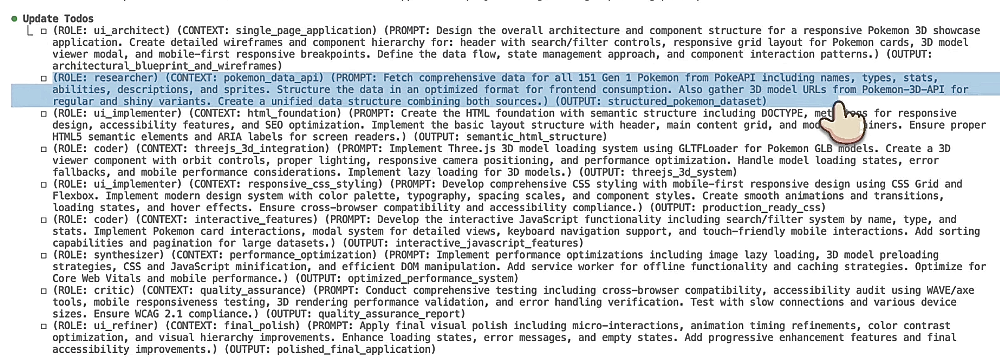

[](https://mseep.ai/app/dnnyngyen-iron-manus-mcp)


[](https://github.com/dnnynguyen/iron-manus-mcp/actions)
[](https://github.com/dnnynguyen/iron-manus-mcp/actions)
[](https://www.typescriptlang.org/)
[](https://nodejs.org/)
[](https://opensource.org/licenses/MIT)
[](https://hub.docker.com/r/dnnyngyen/iron-manus-mcp)
[](https://github.com/dnnynguyen/iron-manus-mcp/pkgs/container/iron-manus-mcp)
[](https://github.com/dnnynguyen/iron-manus-mcp)

# Iron Manus MCP

**Model Context Protocol server for AI workflow orchestration** inspired by Manus AI's orchestration patterns and Andrej Karpathy's "Iron Man" analogy.

## Extended context management through agent delegation and Todos as a custom agent dispatch tool

<div align="center">

### Demo



#### 🎥 Video Tutorial

[](https://www.youtube.com/watch?v=EFVQT3pmyTc)

**[Watch the detailed walkthrough](https://www.youtube.com/watch?v=EFVQT3pmyTc)**

</div>

## Historical Notes: Architectural Patterns

> **Note**: This project is now archived. The following notes document architectural decisions that later appeared in mainstream AI tooling.

Several patterns implemented in Iron Manus MCP (June 2024) were later adopted by Claude Code and similar tools. These emerged from independent experimentation rather than foresight, solving problems that turned out to be common across the ecosystem.

### Patterns That Became Standard

**1. Todos as Subagent Dispatch Queue**

```typescript
interface TodoItem {
  type?: 'TaskAgent' | 'SubAgent' | 'DirectExecution';
  meta_prompt?: MetaPrompt;  // Declarative agent configuration
}
```

This MCP was the first to use todos as a subagent dispatch queue. Claude Code had TodoWrite/TodoRead at that point, but nobody (including Anthropic) was thinking of todos as an agent coordination primitive. The Task tool existed but was just non-specialized agents. Our implementation connected the two: todos become task dispatches. Boris Cherny announced "We're turning Todos into Tasks" on January 22, 2026, seven months after we shipped the same idea.

**2. Phase-Gated Tool Access**

```typescript
const PHASE_ALLOWED_TOOLS = {
  PLAN: ['TodoWrite'],
  EXECUTE: ['TodoRead', 'TodoWrite', 'Task', 'Bash', 'Read', 'Write', 'Edit'],
  VERIFY: ['TodoRead', 'Read'],  // Read-only during verification
};
```

Restricting tool availability by phase prevented misuse (e.g., writing files during verification). This pattern appears in Claude Code Agent Teams (February 2026) via phase-based permissions.

**3. Structured Planning Phase**

The explicit `INIT → QUERY → ENHANCE → KNOWLEDGE → PLAN → EXECUTE → VERIFY → DONE` workflow enforced planning before execution. Claude Code's Plan Mode (August 2025) provides similar structure.

**4. Context Isolation via File-Based Communication**

```
./iron-manus-sessions/{session_id}/
├── synthesized_knowledge.md
├── primary_research.md
└── agent_output.md
```

`Task()` agents have isolated contexts and cannot share state directly. This project used session workspaces for inter-agent coordination. Claude Code Agent Teams implements similar patterns via `~/.claude/teams/` and `~/.claude/tasks/`.

**5. Role-Based Prompt Switching**

Nine specialized roles (`planner`, `coder`, `critic`, `researcher`, `analyzer`, `synthesizer`, `ui_architect`, `ui_implementer`, `ui_refiner`) with distinct thinking methodologies. Claude Code custom subagents (July 2025) provide similar specialization.

**6. Meta-Prompt DSL for Agent Spawning**

```
(ROLE: coder) (CONTEXT: auth_system) (PROMPT: Implement JWT auth) (OUTPUT: auth_module.ts)
```

Declarative syntax for agent configuration embedded in todo content. Similar patterns appear in Claude Code's subagent configuration.

### Timeline Context

Iron Manus MCP (June 2024) introduced todos as subagent dispatch, phase-gated tools, structured planning phases, context isolation, and role-based agents. Claude Code adopted these patterns between July 2025 and February 2026. These patterns emerged from practical necessity. Multi-agent orchestration requires task decomposition, context isolation, and workflow structure, all of which eventually appeared in production tooling.

## What It Does

8-phase workflow orchestration: `INIT → QUERY → ENHANCE → KNOWLEDGE → PLAN → EXECUTE → VERIFY → DONE`

**Tools:**
- `JARVIS` - 8-phase workflow controller
- `APITaskAgent` - API discovery and fetching with SSRF protection
- `PythonComputationalTool` - Python execution for data analysis
- `IronManusStateGraph` - Session state management
- `SlideGenerator` - HTML slide generation
- `HealthCheck` - Runtime diagnostics

## Quick Start

### From Source

```bash
git clone https://github.com/dnnyngyen/iron-manus-mcp
cd iron-manus-mcp
npm install
npm run build
npm start
```

### Docker

```bash
docker build -t iron-manus-mcp .
docker run -d --name iron-manus-mcp iron-manus-mcp
```

Or with docker-compose:
```bash
docker-compose up -d
```

## MCP Integration

Add to Claude Code:
```bash
claude mcp add iron-manus-mcp node dist/index.js
```

Or add to your MCP config:
```json
{
  "mcpServers": {
    "iron-manus-mcp": {
      "command": "node",
      "args": ["path/to/iron-manus-mcp/dist/index.js"]
    }
  }
}
```

## Configuration

```bash
ALLOWED_HOSTS=api.github.com,httpbin.org    # SSRF whitelist
ENABLE_SSRF_PROTECTION=true                  # Enable security
KNOWLEDGE_MAX_CONCURRENCY=2                  # API concurrency limit
KNOWLEDGE_TIMEOUT_MS=4000                    # Request timeout (ms)
```

## Development

```bash
npm run build     # Compile TypeScript
npm run lint      # Check code style
npm run format    # Format code
npm start         # Run server
npm run dev       # Build + watch mode
```

## Security

- SSRF protection blocks private IPs (192.168.x.x, 127.x.x.x, etc.)
- URL validation (HTTP/HTTPS only)
- Host allowlist enforcement
- Request timeout and size limits

## License

MIT
