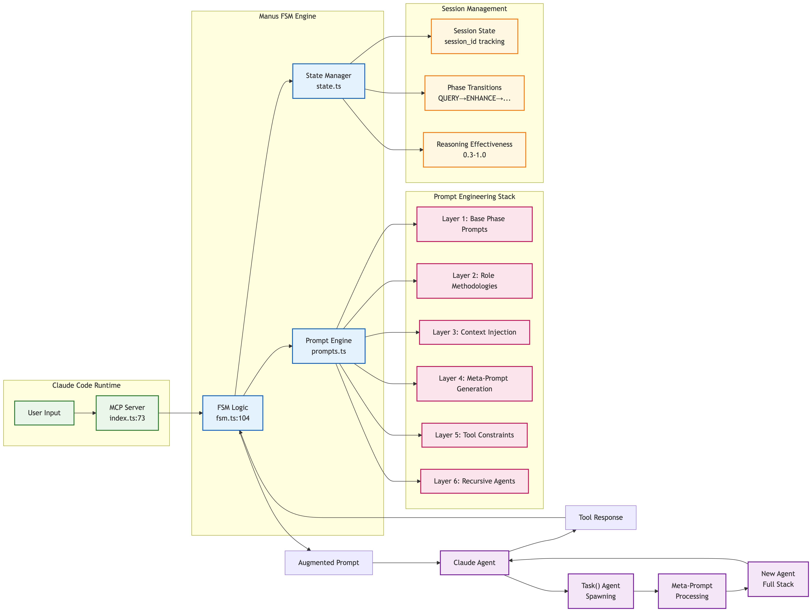

# Iron Manus MCP (Claude-Code Native Infinity Gauntlet)

[](https://github.com/dnnyngyen/iron-manus-mcp/releases)
[]()
[]()
[](https://opensource.org/licenses/MIT)
[]()

**Model Context Protocol Server with Finite State Machine Architecture**

A modular MCP server implementing an 8-phase finite state machine for task orchestration, API integration, and knowledge synthesis.

## Overview

Iron Manus MCP provides a structured approach to task execution through a finite state machine that manages role-based cognitive enhancement, automated API discovery, and knowledge synthesis. The system implements fractal orchestration capabilities for complex task decomposition.

Not affiliated with Manus AI. "Iron Manus" inspired by Andrej Karpathy's "Iron Man" analogy for software development automation.

The system operates without external API keys, utilizing Claude's native tool capabilities for task management and execution.

## Architecture

### Core Components

- **JARVIS FSM Controller** - Implements 8-phase state machine: INIT → QUERY → ENHANCE → KNOWLEDGE → PLAN → EXECUTE → VERIFY → DONE
- **MultiAPIFetch** - Parallel HTTP requests with timeout management and JSON truncation
- **APISearch** - Intelligent API discovery with role-based filtering from 65+ endpoint registry
- **KnowledgeSynthesize** - Cross-validation engine with conflict resolution and confidence scoring

### Key Features

- **Modular Tool System** - Each tool operates independently with consistent interfaces
- **Role-Based Processing** - 9 specialized roles (planner, coder, critic, researcher, analyzer, synthesizer, ui_architect, ui_implementer, ui_refiner)
- **Fractal Orchestration** - Task decomposition through meta-prompt generation and Task() agent spawning
- **Auto-Connection** - Automated API discovery, fetching, and knowledge synthesis

## 🚀 Quick Start Guide

### Prerequisites
- Node.js 18+ installed
- Claude Code CLI tool
- Git (for cloning)

### Method 1: Standard Setup ✅ (Recommended)

**Step 1: Clone and Build**
```bash
git clone https://github.com/dnnyngyen/iron-manus-mcp
cd iron-manus-mcp
npm install
npm run build
```

**Step 2: Register MCP Server**
```bash
claude mcp add iron-manus-mcp node dist/index.js
```

**Step 3: Verify Setup**
```bash
/mcp
```
✅ Expected output: Shows "iron-manus-mcp" server listed

**Step 4: Test Functionality**
In Claude Code, run:
```
Test the JARVIS FSM controller functionality
```
✅ Expected: JARVIS responds with phase progression

### Method 2: Alternative Setup ⚠️ (If Bash Issues)

**Step 1: External Terminal Setup**
```bash
# In regular terminal (outside Claude Code):
git clone https://github.com/dnnyngyen/iron-manus-mcp
cd iron-manus-mcp
npm install
npm run build
```

**Step 2: Register from Claude Code**
```bash
# In Claude Code, use absolute path:
claude mcp add iron-manus-mcp node /full/path/to/iron-manus-mcp/dist/index.js
```

**Step 3: Verify**
```bash
/mcp
```

### Method 3: Bash-Restricted Environment 🔒

**If cd commands fail in Claude Code:**
```bash
# Use prefix flag:
npm install --prefix /path/to/iron-manus-mcp
npm run build --prefix /path/to/iron-manus-mcp

# Then register:
claude mcp add iron-manus-mcp node /path/to/iron-manus-mcp/dist/index.js
```

### 🔍 Verification Commands

**Check MCP Registration:**
```bash
/mcp
```

**Test Core Tool:**
```
Use the JARVIS tool to test basic functionality
```

**🧰 Available Tools After Setup:**
- mcp__iron-manus-mcp__JARVIS (Main FSM controller)
- mcp__iron-manus-mcp__APISearch (API discovery)
- mcp__iron-manus-mcp__MultiAPIFetch (Parallel requests)
- mcp__iron-manus-mcp__KnowledgeSynthesize (Data validation)
- mcp__iron-manus-mcp__APIValidator (Response validation)

### 🛠️ Troubleshooting Setup Issues

**Common Problems:**
1. "No MCP servers configured" - Run registration command from correct directory
2. Bash commands fail - Use Method 2 or 3 above
3. Build errors - Check Node.js version (18+ required)
4. Permission errors - Ensure write access to project directory

**🔧 Quick Diagnostics:**
```bash
node --version          # Check Node.js (should be 18+)
ls dist/index.js        # Verify build completed
node dist/index.js      # Test server (should start, Ctrl+C to exit)
```

**For detailed troubleshooting:** See [TROUBLESHOOTING.md](./docs/TROUBLESHOOTING.md)

## Architecture Overview



**Watch Demo:** [YouTube Video](https://www.youtube.com/watch?v=nImkimPQCjk)

### The Meta-Prompt DSL

```
(ROLE: agent_type) (CONTEXT: domain) (PROMPT: instructions) (OUTPUT: deliverable)
```

This syntax automatically generates specialized prompts for Task() agents:

```typescript
// Simple input:
"(ROLE: coder) (CONTEXT: authentication) (PROMPT: Implement JWT auth) (OUTPUT: production_code)"

// Becomes a full agent prompt with:
// - Role-specific thinking methodologies
// - Domain context and frameworks
// - Quality validation rules
// - Output specifications
```

### 8-Phase Workflow

```
INIT → QUERY → ENHANCE → KNOWLEDGE → PLAN → EXECUTE → VERIFY → DONE
```

Each phase uses native Claude tools for state management and progression:

- **Planning** creates meta-prompt todos via TodoWrite
- **Execution** spawns Task() agents for complex work
- **Verification** ensures quality through systematic checks


## Example Usage

**Input:**

```typescript
await mcp.callTool({
  name: 'JARVIS',
  args: {
    session_id: 'demo',
    initial_objective: 'Create a React dashboard with authentication'
  }
});
```

**Automatic breakdown:**

1. System analyzes the request and detects optimal role (planner)
2. Enhances goal with missing technical requirements
3. Creates specialized todos including meta-prompts
4. Spawns Task(ui_architect) and Task(coder) agents autonomously
5. Agents work independently and report back
6. Verifies completion against success criteria

## Implementation Details

### Architecture

```
iron-manus-mcp/
├── src/
│   ├── index.ts          # MCP server entry point
│   ├── core/
│   │   ├── fsm.ts        # 8-phase state machine
│   │   ├── prompts.ts    # Role-specific prompt templates
│   │   ├── state.ts      # Session management
│   │   ├── types.ts      # Core interfaces
│   │   └── api-registry.ts # 65+ API endpoint registry
│   ├── tools/            # Modular tool system
│   ├── agents/           # Agent definitions
│   └── utils/
├── __tests__/            # Comprehensive test suite
└── docs/                 # Technical documentation
```

### Role Specialization

The system includes specialized roles with distinct thinking methodologies:

- **Planner** - Strategic decomposition and dependency analysis
- **Coder** - Implementation with testing and best practices
- **Critic** - Security review and quality assessment
- **Analyzer** - Data analysis and pattern recognition
- **Researcher** - Information gathering and synthesis
- **Synthesizer** - Integration and optimization
- **UI Architect** - V0-style UI architecture and systematic design
- **UI Implementer** - V0-style UI implementation with concurrent execution
- **UI Refiner** - V0-style UI refinement with polished aesthetics

### Recursive Capabilities

Spawned agents can create their own sub-tasks and spawn additional agents, enabling:

- Unlimited depth of specialization
- Autonomous delegation of complex work
- Self-organizing task hierarchies

## Technical Philosophy

This project explores **Software 3.0** concepts where natural language becomes executable through AI augmentation. Rather than building external orchestration layers, it demonstrates that sophisticated agent behavior can emerge from elegant tool integration.

The approach prioritizes:

- **Simplicity** over complexity
- **Native integration** over external dependencies
- **Emergent behavior** over rigid control structures
- **Experimentation** over premature optimization

## Documentation

- **[ARCHITECTURE.md](./docs/ARCHITECTURE.md)** - Technical deep dive
- **[GETTING_STARTED.md](./docs/GETTING_STARTED.md)** - Tutorial and examples
- **[EXAMPLES.md](./docs/EXAMPLES.md)** - Real usage scenarios
- **[TROUBLESHOOTING.md](./docs/TROUBLESHOOTING.md)** - Setup and environment issues

## Inspiration & Credits

- **Andrej Karpathy** - Software 3.0 vision and AI augmentation concepts
- **Sequential Thinking** - Workflow orchestration patterns (adapted for FSM control)
- **Claude's native tooling** - Foundation capabilities that make this possible

---

**Note**: This is an experimental exploration of native tool integration for agent behavior. The goal is to demonstrate that sophisticated orchestration can emerge from simple, well-designed tool usage rather than complex external systems.

For technical details and implementation guides, see the documentation in the `docs/` directory.
